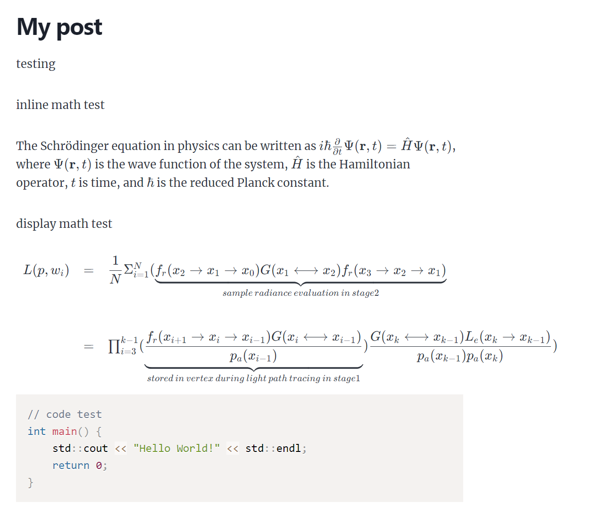
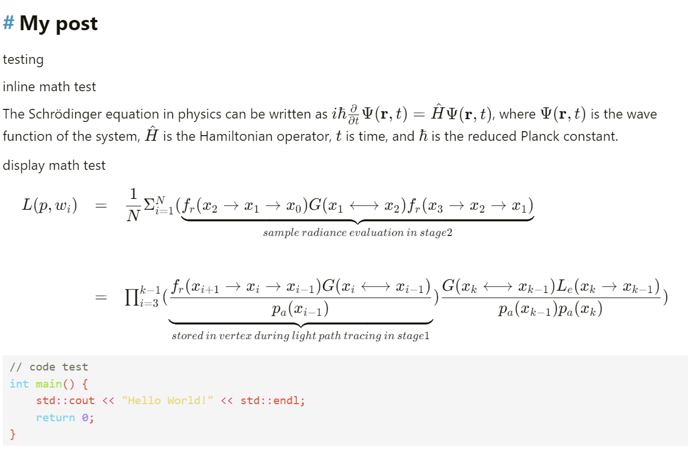
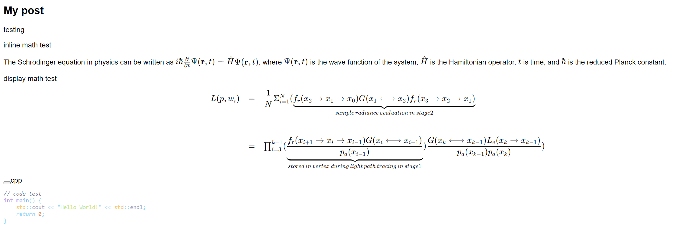
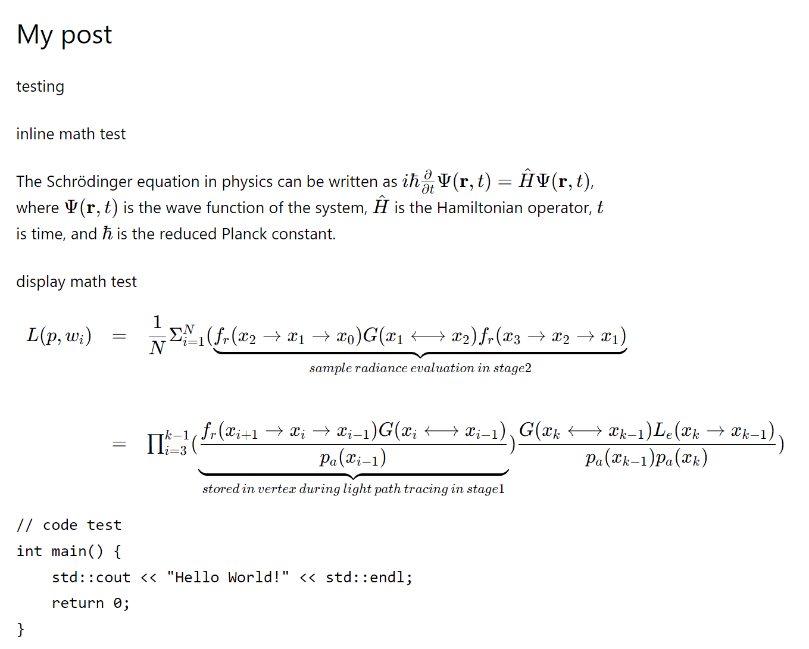

<script setup lang="ts">
const bruh = "$n$"
</script>
# Trying every technical blogging platform

I have an ever-growing list of software engineering topics I want to write about, so naturally I've been spending
an exorbitant amount of
time finding the perfect blogging platform to stow away articles that three people in the world will read. The trouble is,
I like to think I can dabble in theory, so I want a platform that could handle a deluge of math as well as code.

Specifically, my requirements are:
- inline & display math via Katex
- code blocks
- easy editing (preferably markdown)

Some nice pluses I am looking for:
- fast build & deploy times
- custom components
- small bundle size (one day I'll get to Dan Luu's [5kb](https://danluu.com/))

Off the bat I knew of Gatsby, Hugo, and Jekyll, so I made a Minimum Viable Blog with each to and created a [repo](https://github.com/SimonBerens/technical-blog-exploration)
to keep track of what I did to get each site generator working.

## Gatsby
I used the [Gatsby Starter Blog](https://www.gatsbyjs.com/starters/gatsbyjs/gatsby-starter-blog) to get up and running,
and after a little [yak shaving](https://en.wiktionary.org/wiki/yak_shaving) (Gatsby requires Node v18), I had a Gatsby blog running on my computer.

To get math working, I used the [gatsby-remark-katex](https://www.gatsbyjs.com/plugins/gatsby-remark-katex/) package.
The only hiccup I had was needing to restart the dev server to see the effects.

Here is what an example blog post with Gatsby looks like:


Though I was happy with the smooth setup process, Gatsby is notorious for being bloated, so I sought greener pastures.

## Hugo
I had no complaints setting up Hugo. `choco install go hugo` worked on the first try, 
and `hugo new site` was so fast compared to Gatsby that I thought the output was an error message.

However, getting Katex to render in Hugo was no easy task. Initially, 
I started with the [Holy](https://github.com/serkodev/holy) theme, which didn't have math support out of the box.
I tried following [this](https://mertbakir.gitlab.io/hugo/math-typesetting-in-hugo/) guide on getting Katex to work in 
Hugo, but it had trouble with complex equations.

I was about to give up on Hugo when my friend told me that the theme he used, [LoveIt](https://hugoloveit.com/), had
built-in support for math. It turned out to be too good to be true — although I didn't have to manually set up
Katex, it still failed to render complex equations due to Hugo's markdown engine mangling the markdown before giving
it to Katex.

To remedy this, LoveIt provides the `raw` shortcode to escape the markdown parser, but I wasn't thrilled about writing
`{{ bruh }}` to Katex-ify a single variable. If I understand correctly, you actually don't need the `raw` shortcode for
inline equations, but the dev server breaks every time you update the equation, which makes for an unpleasant
latex-writing experience.

Here is what an example blog post with Hugo (using the LoveIt theme) looks like:


Another friend told me he wrote his own extension that rendered latex to images and then used 
css to position them properly depending on whether the equation was in display mode or inline mode.

I wasn't willing to put in that level of investment just yet, so I continued the journey.

## Jekyll
Jekyll was my last resort out of the triad of blog generators that had stood the test of time. 
As _the_ OG static blog generator, I expected it to be able to take anything I threw
at it. Unfortunately, I couldn't even get Jekyll set up on my computer. I thought maybe it was because I was on a 
Windows machine, but I also couldn't get it working on Windows Subsystem for Linux. 

I decided to abandon it after my roommate told me he tried Jekyll in the past and had nothing positive to say about it. 
Honestly, I didn't feel that I was missing out once I saw that `gem --version` took ~3 seconds to execute.

## VitePress
I really didn't like that my choice was between the bloat of Gatsby and the poor development experience of Hugo. I yearned for something
modern, lightweight, and customizable. Out of desperation, I scrolled through the 
[list](https://jamstack.com/generators/) of Jamstack static site generators, where I stumbled upon VitePress.

With the tagline, "Simple, powerful, and fast. Meet the modern SSG framework you've always wanted," 
it felt like my prayers were answered.

The only problem was, the ecosystem had questionable reliability — VitePress had just exited from alpha to beta,
and the seemingly official [Katex extension](https://www.npmjs.com/package/markdown-it-katex) for the markdown parser
VitePress uses ([markdown-it](https://github.com/markdown-it/markdown-it)) was last updated 7 years ago.

I found https://mdit-plugins.github.io/, a repository of markdown-it plugins refactored into Typescript + ESM.
This included the markdown-it-katex plugin, which gave me the confidence to press forward with VitePress.

Here is what an example blog post with VitePress (with no theme) looks like:


## Next.js
I told my friend about how I was wrapping up my quest to find the ultimate technical blogging platform,
and he responded by venting about how annoying setting up his Next.js + MDX blog was. So here we are.

It turns out that next has a [blog starter repo](https://github.com/vercel/next.js/tree/canary/examples/blog-starter)
which is fairly easy to use. It also uses the 
[unified](https://unifiedjs.com/)/[remark](https://github.com/remarkjs/remark) ecosystem, which seems to be better
maintained than markdown-it. 

Getting Katex to work was just a matter of installing the [remark-math](https://github.com/remarkjs/remark-math)
packages and adding the Katex CSS CDN to the header.

Here is what an example blog post with Next looks like:


## Next.js vs. VitePress
Now that I had finished exploring options, it was time to pick one for my blog. The decision was mostly between
Next.js and VitePress — both used markdown, both were easy to integrate with Katex, and both let you write custom components
in your markdown.

| Next.js                                                                     | VitePress                                                                                            |
|-----------------------------------------------------------------------------|------------------------------------------------------------------------------------------------------|
| - I'm more familiar with React<br/> - Mature, maintained markdown ecosystem | - Default theme has a lot of nice things out of the box<br/> - Fast build times<br/> - (Con) In beta |

In the end, I decided I had stalled writing my first post long enough 
and didn't want to re-implement the nice features VitePress had:
- code highlighting with [Shiki](https://shiki.matsu.io/)
- copy code button
- [code groups](https://vitepress.dev/guide/markdown#code-groups)
- collapsible sections
- [data loaders](https://vitepress.dev/guide/data-loading#createcontentloader)
- dark mode toggle
- social icons

Here's an example of a codeblock with all the goodies VitePress provides:

```cpp
// code test
int main() {
    std::cout << "Hello World!" << std::endl;
    return 0;
}
```

If you want to use VitePress for your technical blog, I made a 
[github template](https://github.com/SimonBerens/technical-blog-template) you can use that comes with Katex set up.

## Aside: WYSIWYG editors
### Hashnode
Hashnode is a blogging platform for devs, so math isn't its main focus. Nevertheless, they have display mode math 
powered by Mathjax built into their editor.

### Ghost
When trying Ghost, I used [this](https://www.naut.ca/blog/2019/04/01/quickly-add-latex-math-rendering-to-a-ghost-blog/)
blog post to add Katex to my site. It only works for latex on a single line — multi line latex will be mangled by the
parser.

### Medium
Medium doesn't support math, so it seems people to resort to embedding images of rendered math.

### Substack
My [non-technical blog](https://simonberens.com/) is on Substack. It's a great platform for writing and building 
an audience, but it's not very customizable. They have beta support for display mode latex, but I don't think inline
mode is coming any time soon. 

I imagine this is because they want to make sure their emails look exactly like the online version of a published article, but the
constraints on email make rendering math very tricky. At one point I tried to write a naive email math renderer
(inline all of Katex's css), but it generated emails too large to send.

Google is working on a [new format](https://amp.dev/about/email) for email that could make this easier, but it hasn't
picked up steam.

## Aside: Katex vs. Mathjax
Katex and Mathjax are the two most popular ways to render math on the web. Katex is supposedly significantly faster
than Mathjax, which is why I put it as a requirement at the beginning of my search.
In the Katex [homepage](https://katex.org/), there is even a GIF of Katex loading significantly faster than Mathjax.

However, apparently this GIF is outdated as it compares Katex to Mathjax v2. Since then, there has been a new major
release of Mathjax, Mathjax v3, which promises significant performance increases compared to v2. My understanding is
that Mathjax can render a more complete subset of Latex and render it prettier.

This made me question if I was just another pawn for Big Katex, spreading outdated rumors of its speed.
But digging deeper, it turns out that Mathjax v3 [broke line breaks](https://github.com/mathjax/MathJax/issues/2312),
which makes it unusable for complex equations.
Mathjax v4 is in [alpha](https://github.com/mathjax/MathJax-src/releases/tag/4.0.0-alpha.1), and it promises
to fix the lack of line breaking in v3.